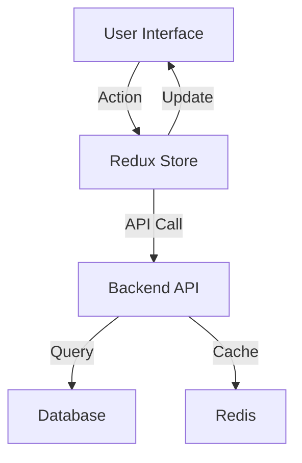

# JobExel - AI-Powered Career Development Platform

<div align="center">
  
  <p>Intelligent career management and job search platform powered by AI</p>
  
  [](https://nextjs.org/)
  [](https://www.typescriptlang.org/)
  [](LICENSE)
  [](CONTRIBUTING.md)
</div>

## 📚 Table of Contents

- [Overview](#overview)
- [Features](#features)
- [Tech Stack](#tech-stack)
- [Getting Started](#getting-started)
- [Architecture](#architecture)
- [API Documentation](#api-documentation)
- [Contributing](#contributing)
- [License](#license)

## 🚀 Overview

JobExel is a comprehensive career development platform that leverages AI to streamline job searching, application tracking, and professional growth. Our platform combines modern technologies with intelligent features to provide an enhanced job search experience.

### Key Metrics & Goals
```typescript
interface PlatformMetrics {
  userEngagement: {
    dailyActiveUsers: number;
    averageSessionDuration: number;
    applicationCompletionRate: number;
  };
  aiPerformance: {
    resumeParsingAccuracy: number;
    matchingPrecision: number;
    generationQuality: number;
  };
  systemHealth: {
    apiLatency: number;
    errorRate: number;
    availability: number;
  };
}
```

## ✨ Features

### 1. AI-Powered Resume Builder
```typescript
// src/features/resume/ResumeBuilder.tsx
interface ResumeBuilderProps {
  initialData?: ParsedResume;
  templates: ResumeTemplate[];
  aiSuggestions?: boolean;
}

export function ResumeBuilder({ initialData, templates, aiSuggestions }: ResumeBuilderProps) {
  const [activeTemplate, setActiveTemplate] = useState<ResumeTemplate>(templates[0]);
  const [content, setContent] = useState<ResumeContent>(initialData || {});
  
  const { suggestions, isLoading } = useAISuggestions(content, {
    enabled: aiSuggestions,
  });

  return (
    <div className="resume-builder">
      <TemplateSelector
        templates={templates}
        active={activeTemplate}
        onSelect={setActiveTemplate}
      />
      <ResumeEditor
        content={content}
        onChange={setContent}
        suggestions={suggestions}
      />
      <ResumePreview
        template={activeTemplate}
        content={content}
      />
    </div>
  );
}
```

### 2. Job Search & Tracking
```typescript
// src/features/jobs/JobBoard.tsx
interface JobBoardProps {
  filters: JobFilters;
  view: 'grid' | 'list';
}

export function JobBoard({ filters, view }: JobBoardProps) {
  const { data: jobs, isLoading } = useQuery({
    queryKey: ['jobs', filters],
    queryFn: () => fetchJobs(filters),
  });

  const { matchScore } = useJobMatching(jobs);

  return (
    <div className="job-board">
      <JobFilters current={filters} />
      {view === 'grid' ? (
        <JobGrid jobs={jobs} matchScore={matchScore} />
      ) : (
        <JobList jobs={jobs} matchScore={matchScore} />
      )}
    </div>
  );
}
```

## 🛠 Tech Stack

### Frontend
- **Framework**: Next.js 14
- **Language**: TypeScript
- **Styling**: Tailwind CSS, shadcn/ui
- **State Management**: Redux Toolkit, RTK Query
- **Data Fetching**: TanStack Query

### Backend
- **Runtime**: Node.js
- **API**: Express, GraphQL
- **Database**: PostgreSQL (Drizzle ORM)
- **Caching**: Redis
- **Search**: Elasticsearch

### AI & Machine Learning
- **NLP**: OpenAI GPT-4
- **Resume Parsing**: Custom ML models
- **Job Matching**: Similarity algorithms

## 🏃‍♂️ Getting Started

1. **Clone the repository**
```bash
git clone https://github.com/yourusername/jobexel.git
cd jobexel
```

2. **Install dependencies**
```bash
pnpm install
```

3. **Set up environment variables**
```bash
cp .env.example .env.local
# Edit .env.local with your configuration
```

4. **Start development server**
```bash
pnpm dev
```

## 🏗 Architecture

### Component Structure
```typescript
src/
├── components/          # Reusable UI components
├── features/           # Feature-specific components
├── hooks/             # Custom React hooks
├── lib/               # Utility functions and services
├── pages/             # Next.js pages
├── styles/            # Global styles and themes
└── types/             # TypeScript type definitions
```

### Data Flow


## 📝 API Documentation

### Authentication
```typescript
// Example authentication request
const response = await fetch('/api/auth/login', {
  method: 'POST',
  headers: {
    'Content-Type': 'application/json',
  },
  body: JSON.stringify({
    email: 'user@example.com',
    password: 'secure_password',
  }),
});

const { token, user } = await response.json();
```

### Job Search
```typescript
// Example job search request
const jobs = await fetch('/api/jobs/search', {
  method: 'GET',
  headers: {
    'Authorization': `Bearer ${token}`,
  },
  params: {
    query: 'software engineer',
    location: 'remote',
    experience: 'mid-level',
  },
});
```

## 🤝 Contributing

We welcome contributions! Please see our [Contributing Guide](CONTRIBUTING.md) for details.

### Development Workflow
1. Fork the repository
2. Create a feature branch
3. Make your changes
4. Submit a pull request

## 📄 License

JobExel is [MIT licensed](LICENSE).

---

## 📞 Contact

- **Website**: [https://jobexel.com](https://jobexel.com)
- **Email**: support@jobexel.com
- **Twitter**: [@JobExel](https://twitter.com/JobExel)

---

<div align="center">
  <p>Built with ❤️ by the JobExel Team</p>
</div> 