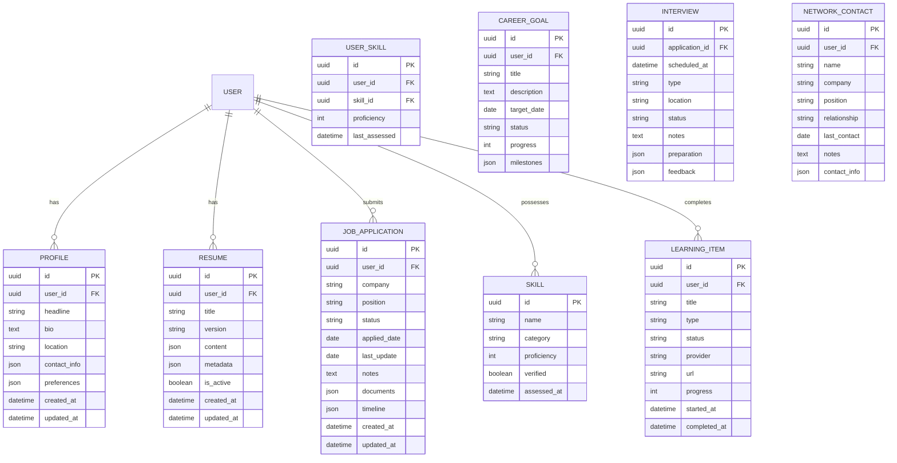

# JobExel - Career Intelligence Platform 🚀💼

<div align="center">
  
  
  [](LICENSE)
  [](VERSION)
  [](https://reactjs.org/)
  [](https://nextjs.org/)
  [](https://www.typescriptlang.org/)
  [](https://tailwindcss.com/)
  
  <h3>AI-powered career acceleration for modern professionals</h3>
</div>

## 📋 Table of Contents

- [Introduction](#-introduction)
- [Key Features](#-key-features)
- [Core Technologies](#-core-technologies)
- [System Architecture](#-system-architecture)
- [User Flows](#-user-flows)
- [AI Integration](#-ai-integration)
- [Database Schema](#-database-schema)
- [API Reference](#-api-reference)
- [Getting Started](#-getting-started)
- [Development Guide](#-development-guide)
- [Deployment](#-deployment)
- [Contributing](#-contributing)
- [License](#-license)
- [Support](#-support)

## 🌟 Introduction

JobExel is a comprehensive career intelligence platform designed to transform how professionals manage their career trajectory, optimize their job search process, and build resilience throughout their professional journey.

As part of the larger Exel ecosystem, JobExel integrates seamlessly with other products:
- 🎓 **UniExel** - Academic and early career planning
- 🚀 **StartupExel** - Entrepreneurship development
- 🏢 **ExelBusiness** - Enterprise solutions

### Why JobExel? 🤔

- **✅ Fragmentation Problem**: Most professionals use 5-7 different tools to manage their career
- **✅ Data Silos**: Critical insights are lost between disconnected platforms
- **✅ Time Waste**: Hours spent on repetitive, low-value career tasks
- **✅ Optimization Gap**: Limited data-driven career decision making

JobExel solves these challenges through an integrated, AI-powered approach to career management.

## ✨ Key Features

### 📄 Resume Optimization

AI-powered resume tailoring that matches your experience to job descriptions with surgical precision, improving ATS compatibility and highlighting relevant accomplishments.

<div align="center">
  
</div>

```typescript
// Example: Resume keyword extraction and matching
const analyzeJobMatch = (resumeText: string, jobDescription: string) => {
  // Extract key requirements from job description
  const requirements = extractKeyRequirements(jobDescription);
  
  // Analyze resume content against requirements
  const matches = requirements.map(req => ({
    requirement: req,
    found: resumeContains(resumeText, req),
    confidence: calculateConfidence(resumeText, req),
    suggestions: generateSuggestions(resumeText, req)
  }));
  
  // Calculate overall match score
  const matchScore = calculateOverallMatch(matches);
  
  return {
    matchScore,
    matches,
    improvementSuggestions: generateImprovementPlan(matches)
  };
};
```

### 📊 Application Tracker

Comprehensive system for managing your job search pipeline, with automated status tracking, follow-up reminders, and performance analytics.

<div align="center">
  
</div>

**Key Features:**
- 📌 Kanban-style application board
- 📅 Automated follow-up reminders
- 📈 Application success rate analytics
- 🔄 Integrated with email for automatic status updates
- 📁 Document management for each application

### 🎯 Career Path Planning

Data-driven career trajectory planning with skills gap analysis, personalized learning recommendations, and milestone tracking.

<div align="center">
  
</div>

### 🤖 AI Interview Coach

Practice with personalized interview simulations based on job descriptions, with real-time feedback on responses, body language, and presentation.

```typescript
// Interview Analysis Engine
interface InterviewAnalysis {
  technicalAccuracy: number;  // 0-100 score
  communicationClarity: number;  // 0-100 score
  relevanceToQuestion: number;  // 0-100 score
  improvementSuggestions: string[];
  strengthHighlights: string[];
}

const analyzeInterviewResponse = async (
  question: string,
  response: string,
  jobRole: string
): Promise<InterviewAnalysis> => {
  // Analyze response using AI model
  const analysisResult = await aiService.analyzeInterviewResponse({
    question,
    response,
    context: { jobRole }
  });
  
  return {
    technicalAccuracy: analysisResult.scores.technical,
    communicationClarity: analysisResult.scores.communication,
    relevanceToQuestion: analysisResult.scores.relevance,
    improvementSuggestions: analysisResult.suggestions,
    strengthHighlights: analysisResult.strengths
  };
};
```

### 📚 Skills Development Hub

Gap analysis and personalized learning paths to enhance your professional capabilities with integration to learning platforms.

### 👥 Network Manager

Strategic networking tools to build and leverage professional relationships effectively.

### 🛡️ Career Resilience Center

Resources and tools to handle rejection, manage career transitions, and maintain professional well-being.

## 🛠️ Core Technologies

JobExel is built with a modern technology stack focused on performance, scalability, and developer experience:

### Frontend
- **Next.js**: React framework for server-rendered applications
- **React**: Component-based UI library
- **TypeScript**: Type-safe JavaScript
- **TailwindCSS**: Utility-first CSS framework
- **shadcn/ui**: Component library built on Radix UI
- **Zustand**: Lightweight state management
- **React Query**: Data fetching and caching
- **Recharts**: Data visualization

### Backend
- **Node.js**: JavaScript runtime
- **Express**: Web framework
- **tRPC**: End-to-end typesafe APIs
- **Prisma**: ORM for database access
- **PostgreSQL**: Primary database
- **Redis**: Caching and session management
- **Bull**: Job queue for background processing

### AI & ML
- **OpenAI API**: For natural language understanding and generation
- **TensorFlow.js**: For client-side ML models
- **Langchain**: For complex AI workflows
- **Pinecone**: Vector database for semantic search

### DevOps
- **Docker**: Containerization
- **GitHub Actions**: CI/CD
- **Vercel**: Deployment platform
- **Jest**: Testing framework
- **Cypress**: End-to-end testing

## 🏗️ System Architecture

JobExel follows a modern microservices architecture with clear separation of concerns, ensuring scalability and maintainability.


### System Components

| Component | Purpose | Implementation |
|-----------|---------|----------------|
| Client Application | User interface | Next.js, React, TailwindCSS |
| API Gateway | Route requests to services | Next.js API Routes, tRPC |
| Auth Service | User authentication | NextAuth.js, JWT |
| User Profile Service | Manage user data | Prisma, PostgreSQL |
| Resume Service | Resume operations | Express, MongoDB |
| Job Application Service | Track applications | Express, PostgreSQL |
| Learning Service | Skills development | Express, PostgreSQL |
| Analytics Service | User insights | Node.js, TimeseriesDB |
| AI Orchestration | Manage AI services | Python, FastAPI |
| Background Jobs | Async processing | Bull, Redis |

## 👤 User Flows

### Onboarding Flow

The onboarding process is designed to provide immediate value while progressively building a complete profile.


### Resume Optimization Flow


### Job Application Tracking Flow


## 🧠 AI Integration

JobExel leverages AI throughout the platform to provide intelligent career guidance and automate routine tasks.

### AI Architecture


### AI Capabilities

| Feature | AI Technology | Function |
|---------|---------------|----------|
| Resume Parser | Named Entity Recognition | Extract structured data from resumes |
| Job Match | Semantic Similarity | Calculate resume-job compatibility |
| Interview Coach | LLM + Speech Analysis | Provide interview feedback |
| Skills Gap | Knowledge Graph | Identify missing skills for target roles |
| Career Path | Predictive Analytics | Recommend optimal career moves |
| Content Generation | LLM | Create tailored professional documents |

### Example AI Implementation

```typescript
// Resume-Job Matching Algorithm
import { embedText, cosineSimilarity } from '@/lib/ai/embeddings';

type MatchResult = {
  overallScore: number;
  sectionScores: Record<string, number>;
  keywords: {
    matched: string[];
    missing: string[];
  };
  suggestions: string[];
};

const matchResumeToJob = async (
  resumeText: string, 
  jobDescription: string
): Promise<MatchResult> => {
  // Generate embeddings for resume and job description
  const resumeEmbedding = await embedText(resumeText);
  const jobEmbedding = await embedText(jobDescription);
  
  // Calculate overall semantic similarity
  const overallScore = cosineSimilarity(resumeEmbedding, jobEmbedding) * 100;
  
  // Section-by-section analysis
  const sections = ['experience', 'education', 'skills'];
  const sectionScores = {};
  
  for (const section of sections) {
    const resumeSection = extractSection(resumeText, section);
    const jobSection = extractSection(jobDescription, section);
    
    if (resumeSection && jobSection) {
      const resumeSectionEmbedding = await embedText(resumeSection);
      const jobSectionEmbedding = await embedText(jobSection);
      sectionScores[section] = cosineSimilarity(resumeSectionEmbedding, jobSectionEmbedding) * 100;
    }
  }
  
  // Keyword analysis
  const jobKeywords = extractKeywords(jobDescription);
  const resumeKeywords = extractKeywords(resumeText);
  
  const matched = jobKeywords.filter(kw => 
    resumeKeywords.some(rk => isSimilar(kw, rk))
  );
  
  const missing = jobKeywords.filter(kw => 
    !resumeKeywords.some(rk => isSimilar(kw, rk))
  );
  
  // Generate improvement suggestions
  const suggestions = await generateSuggestions(resumeText, jobDescription, {
    missingKeywords: missing,
    sectionScores
  });
  
  return {
    overallScore,
    sectionScores,
    keywords: {
      matched,
      missing
    },
    suggestions
  };
};
```

## 🗄️ Database Schema

JobExel uses a sophisticated database schema to represent career-related entities and their relationships.



## 📡 API Reference

JobExel offers a comprehensive API for integration with other services and extensions.

### Authentication

```typescript
/**
 * User authentication
 * POST /api/auth/login
 */
interface LoginRequest {
  email: string;
  password: string;
}

interface LoginResponse {
  token: string;
  user: {
    id: string;
    email: string;
    name: string;
  };
}

/**
 * Example usage:
 */
const login = async (email: string, password: string) => {
  const response = await fetch('/api/auth/login', {
    method: 'POST',
    headers: {
      'Content-Type': 'application/json',
    },
    body: JSON.stringify({ email, password }),
  });
  
  if (!response.ok) {
    throw new Error('Authentication failed');
  }
  
  return response.json();
};
```

### Resume Management

| Endpoint | Method | Description |
|----------|--------|-------------|
| `/api/resumes` | GET | Get all user resumes |
| `/api/resumes/:id` | GET | Get specific resume |
| `/api/resumes` | POST | Create a new resume |
| `/api/resumes/:id` | PUT | Update a resume |
| `/api/resumes/:id` | DELETE | Delete a resume |
| `/api/resumes/analyze` | POST | Analyze resume quality |
| `/api/resumes/optimize` | POST | Get optimization suggestions |

### Job Application Tracking

| Endpoint | Method | Description |
|----------|--------|-------------|
| `/api/applications` | GET | Get all applications |
| `/api/applications/:id` | GET | Get specific application |
| `/api/applications` | POST | Create application |
| `/api/applications/:id/status` | PUT | Update application status |
| `/api/applications/statistics` | GET | Get application statistics |

Full API documentation is available at the `/api/docs` endpoint.

## 🚀 Getting Started

### Prerequisites

- Node.js (v18+)
- npm or pnpm
- PostgreSQL database
- OpenAI API key (for AI features)

### Installation

```bash
# Clone the repository
git clone https://github.com/exel/jobexel.git
cd jobexel

# Install dependencies
pnpm install

# Configure environment variables
cp .env.example .env.local
# Edit .env.local with your database and API credentials

# Run database migrations
pnpm prisma migrate dev

# Start development server
pnpm dev
```

### Initial Setup

After installation, navigate to http://localhost:3000 and follow the setup wizard to:

1. Create an admin account
2. Configure basic settings
3. Set up AI integration
4. Import initial data (optional)

## 💻 Development Guide

### Project Structure

```
jobexel/
├── public/                # Static assets
├── src/
│   ├── app/               # Next.js App Router
│   │   ├── api/           # API routes
│   │   ├── auth/          # Authentication pages
│   │   ├── dashboard/     # Dashboard pages
│   │   ├── resume/        # Resume builder
│   │   ├── applications/  # Job applications
│   │   └── settings/      # User settings
│   ├── components/        # React components
│   │   ├── ui/            # Base UI components
│   │   ├── features/      # Feature-specific components
│   │   └── layout/        # Layout components
│   ├── lib/               # Utility functions
│   │   ├── ai/            # AI utilities
│   │   ├── auth/          # Auth utilities
│   │   └── api/           # API utilities
│   ├── services/          # Business logic
│   ├── types/             # TypeScript types
│   └── utils/             # Helper functions
├── prisma/                # Database schema and migrations
├── scripts/               # Build and deployment scripts
├── tests/                 # Test suite
├── .env.example           # Example environment variables
└── package.json           # Project dependencies
```

### Key Development Commands

```bash
# Run development server
pnpm dev

# Run tests
pnpm test

# Run linting
pnpm lint

# Format code
pnpm format

# Build for production
pnpm build

# Start production server
pnpm start

# Generate database types
pnpm prisma generate

# Run database migrations
pnpm prisma migrate dev
```

### Component Example

```tsx
// src/components/features/resume/MatchScore.tsx
import React from 'react';
import { Progress } from '@/components/ui/progress';
import { Badge } from '@/components/ui/badge';
import { StarIcon } from 'lucide-react';

interface MatchScoreProps {
  score: number;
  matchedKeywords: string[];
  missingKeywords: string[];
}

export const MatchScore: React.FC<MatchScoreProps> = ({
  score,
  matchedKeywords,
  missingKeywords
}) => {
  const getScoreColor = () => {
    if (score >= 80) return 'bg-green-500';
    if (score >= 60) return 'bg-yellow-500';
    return 'bg-red-500';
  };
  
  return (
    <div className="space-y-4 p-4 border rounded-lg bg-white shadow-sm">
      <div className="flex items-center justify-between">
        <h3 className="text-lg font-medium flex items-center">
          <StarIcon className="mr-2 h-5 w-5 text-blue-500" />
          Match Score
        </h3>
        <span className="text-2xl font-bold">{Math.round(score)}%</span>
      </div>
      
      <Progress value={score} className={`h-2 ${getScoreColor()}`} />
      
      <div className="pt-2">
        <h4 className="text-sm font-medium mb-2">Matched Keywords</h4>
        <div className="flex flex-wrap gap-2">
          {matchedKeywords.map(keyword => (
            <Badge key={keyword} variant="outline" className="bg-green-50 text-green-700">
              {keyword}
            </Badge>
          ))}
          {matchedKeywords.length === 0 && (
            <span className="text-sm text-gray-500 italic">No keywords matched</span>
          )}
        </div>
      </div>
      
      <div>
        <h4 className="text-sm font-medium mb-2">Missing Keywords</h4>
        <div className="flex flex-wrap gap-2">
          {missingKeywords.map(keyword => (
            <Badge key={keyword} variant="outline" className="bg-red-50 text-red-700">
              {keyword}
            </Badge>
          ))}
          {missingKeywords.length === 0 && (
            <span className="text-sm text-gray-500 italic">No missing keywords</span>
          )}
        </div>
      </div>
    </div>
  );
};
```

## 🚢 Deployment

JobExel can be deployed in various environments:

### Vercel Deployment

```bash
# Install Vercel CLI
npm install -g vercel

# Deploy to Vercel
vercel
```

### Docker Deployment

```bash
# Build Docker image
docker build -t jobexel .

# Run Docker container
docker run -p 3000:3000 -e DATABASE_URL=YOUR_DB_URL jobexel
```

### Self-Hosted Deployment

```bash
# Build for production
pnpm build

# Start production server
pnpm start
```

## 👥 Contributing

We welcome contributions to JobExel! Please follow these steps:

1. Fork the repository
2. Create a feature branch (`git checkout -b feature/amazing-feature`)
3. Make your changes
4. Run tests (`pnpm test`)
5. Commit your changes (`git commit -m 'feat: add amazing feature'`)
6. Push to your branch (`git push origin feature/amazing-feature`)
7. Open a Pull Request

We follow conventional commits for commit messages and maintain a high standard of code quality through linting and testing.

## 📄 License

JobExel is proprietary software owned by Exel, Inc. All rights reserved.

## 🆘 Support

For support, questions, or feature requests, please:

- 📧 Email: support@jobexel.com
- 📚 Documentation: [docs.jobexel.com](https://docs.jobexel.com)
- 🐞 Issues: [GitHub Issues](https://github.com/exel/jobexel/issues)
- 💬 Community: [Discord Community](https://discord.gg/jobexel)

---

<div align="center">
  <p>Built with ❤️ by Ian Kuria - Senior Dev - the Exel Team</p>
  <p>
      <a href="https://kuria.pro">Ian Kuria - Get in touch</a>
  </p>
</div>
