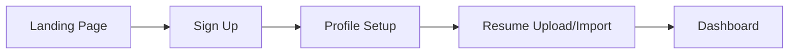
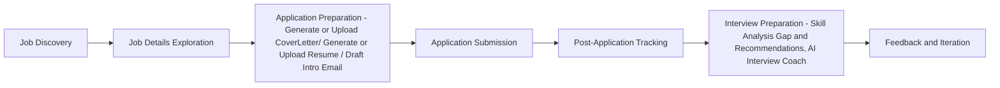

# JobExel Design Document

## System Architecture

### Overview
JobExel follows a modern, scalable architecture pattern using microservices and cloud-native technologies.

### Architecture Layers

#### 1. Frontend Layer
- **Framework**: Next.js 14 with TypeScript
- **Components**: 
  - Atomic design pattern
  - Server and Client components
  - Reusable UI components
- **State Management**:
  - SWR for data fetching
  - React Context for global state
  - Local state for component-specific data

#### 2. Backend Layer
- **API Services**:
  - RESTful endpoints
  - GraphQL for complex queries
  - WebSocket for real-time updates
- **Microservices**:
  - User Service
  - Job Service
  - Application Service
  - AI Service
- **Authentication**:
  - NextAuth.js
  - JWT tokens
  - Role-based access control

#### 3. Data Layer
- **Databases**:
  - PostgreSQL for structured data
  - MongoDB for unstructured data
- **Caching**:
  - Redis for session management
  - Edge caching for static content
- **File Storage**:
  - AWS S3 for document storage
  - CDN for media delivery

## UI/UX Design

### Design System
- **Colors**:
  ```css
  --primary: #0F172A;
  --secondary: #3B82F6;
  --accent: #22C55E;
  --background: #FFFFFF;
  --text: #1F2937;
  ```
- **Typography**:
  - Font: Inter
  - Scale: 12px, 14px, 16px, 18px, 24px, 32px
- **Spacing**:
  - Base unit: 4px
  - Scale: 4px, 8px, 16px, 24px, 32px, 48px

### Component Library
- **Base Components**:
  - Button (primary, secondary, outline)
  - Input fields
  - Cards
  - Modals
- **Complex Components**:
  - Job Board
  - Resume Builder
  - Application Tracker
  - AI Feedback Panel

### Responsive Design
- **Breakpoints**:
  ```css
  --mobile: 320px;
  --tablet: 768px;
  --desktop: 1024px;
  --large: 1440px;
  ```
- **Layout Grid**:
  - Mobile: 4 columns
  - Tablet: 8 columns
  - Desktop: 12 columns

### User Interface Flows

#### 1. Onboarding Flow


#### 2. Job Application Flow


## Data Models

### User Model
```typescript
interface User {
  id: string;
  email: string;
  name: string;
  role: 'jobseeker' | 'recruiter' | 'admin';
  profile: {
    headline: string;
    location: string;
    skills: string[];
    experience: Experience[];
    education: Education[];
  };
  settings: {
    notifications: NotificationPreferences;
    privacy: PrivacySettings;
  };
  createdAt: Date;
  updatedAt: Date;
}
```

### Job Model
```typescript
interface Job {
  id: string;
  title: string;
  company: {
    id: string;
    name: string;
    logo: string;
  };
  location: {
    type: 'remote' | 'onsite' | 'hybrid';
    country: string;
    city?: string;
  };
  salary: {
    min: number;
    max: number;
    currency: string;
  };
  description: string;
  requirements: string[];
  benefits: string[];
  status: 'active' | 'closed';
  postedAt: Date;
  expiresAt: Date;
}
```

### Application Model
```typescript
interface Application {
  id: string;
  userId: string;
  jobId: string;
  status: 'applied' | 'reviewing' | 'interviewing' | 'offered' | 'rejected';
  resume: {
    url: string;
    version: number;
  };
  coverLetter?: {
    url: string;
    version: number;
  };
  aiMatch: {
    score: number;
    feedback: string[];
  };
  timeline: {
    appliedAt: Date;
    lastUpdated: Date;
    events: ApplicationEvent[];
  };
}
```

## Integration Points

### External Services
1. **OpenAI Integration**
   - Resume parsing
   - Job matching
   - Cover letter generation

2. **LinkedIn Integration**
   - Profile import
   - Easy apply
   - Job synchronization

3. **Job Boards Integration**
   - Indeed
   - Glassdoor
   - LinkedIn Jobs

### Internal Services
1. **Analytics Service**
   - User behavior tracking
   - Application success rates
   - Search patterns

2. **Notification Service**
   - Email notifications
   - In-app notifications
   - Push notifications

## Security Considerations

### Data Protection
- Encryption at rest
- Secure data transmission
- Regular security audits

### Access Control
- Role-based permissions
- API rate limiting
- Session management

## Performance Optimization

### Caching Strategy
- Client-side caching
- Server-side caching
- CDN integration

### Load Balancing
- Geographic distribution
- Auto-scaling
- Failover mechanisms

## Monitoring and Analytics

### System Metrics
- Response times
- Error rates
- Resource utilization

### User Analytics
- Engagement metrics
- Conversion rates
- User satisfaction scores 